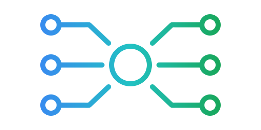

# Conduit 

### Multi‑Format, Database‑Agnostic REST Engine

Conduit is a **zero‑boilerplate REST engine** that instantly exposes your database as a fully‑typed, multi‑format HTTP API.  
It supports **JSON, XML, YAML, TOML, NDJSON, CSV, and CBOR** — simultaneously — and works with **any SQL database** through a pluggable driver system.

Conduit eliminates the need to hand‑craft REST interfaces, controllers, serializers, or schema definitions.  
Point it at a database, start the server, and your tables become live REST endpoints.

---

## ✨ Key Features

- **Multi‑format input & output**  
  JSON, XML, YAML, TOML, NDJSON, CSV, CBOR — all first‑class citizens.

- **Database‑agnostic**  
  Official drivers for SQLite, PostgreSQL, MySQL/MariaDB, SQL Server, libSQL/Turso, ClickHouse, and Oracle.

- **Zero‑code REST API generation**  
  Every table becomes an endpoint automatically.

- **Schema creation via API**  
  Create new tables with `POST /v1/schema/<table>`.

- **Pluggable backend architecture**  
  Swap databases or authorization modules without changing your API.

- **Strong typing with graceful fallback**  
  SQL types are preserved when possible; incompatible types (e.g., datetime) are safely represented as strings.

- **Config‑driven behavior**  
  Conduit auto‑detects config files in JSON, YAML, TOML, or XML.

- **Simple deployment**  
  Single static binary or `go install`.

- **MIT‑licensed open core**  
  Free to use, extend, and integrate.

---

## 🚀 Why Conduit?

Conduit combines:

- **Multi‑format I/O**
- **Database‑agnostic routing**
- **Instant REST generation**

…into a single engine that requires **no code** to expose a fully functional API.

It's ideal for:

- Rapid prototyping
- Internal tools
- Data ingestion pipelines
- Multi‑format integrations
- Database‑first applications
- Enterprise environments needing consistent REST interfaces

---

## 🧩 Architecture Overview

```
              ┌────────────────────────────────┐
              │          HTTP Request          │
              │ JSON / XML / YAML / TOML / CSV │
              └──────────────┬─────────────────┘
                               ▼
                    ┌───────────────────┐
                    │   Format Parser   │
                    └─────────┬─────────┘
                              ▼
                    ┌───────────────────┐
                    │   Conduit Core    │
                    │  Routing + Auth   │
                    └─────────┬─────────┘
                              ▼
                    ┌───────────────────┐
                    │   DB Driver API   │
                    │ SQLite / PG / ... │
                    └─────────┬─────────┘
                              ▼
                    ┌───────────────────┐
                    │   SQL Database    │
                    └─────────┬─────────┘
                              ▼
              ┌────────────────────────────────┐
              │          HTTP Response         │
              │ JSON / XML / YAML / TOML / CSV │
              └────────────────────────────────┘
```

---

## 📦 Installation

### Option A — Go Install

```bash
go install github.com/untappedtech/conduit@latest
```

### Option B — Download Binary

Prebuilt binaries are available under **GitHub Releases**.

### Option C — Build From Source

```bash
git clone https://github.com/untappedtech/conduit
cd conduit
go build ./cmd/server
```

---

## ⚙️ Configuration

Conduit automatically searches for a config file in this order:

1. `config.json`
2. `config.yaml`
3. `config.yml`
4. `config.toml`
5. `config.xml`

You can also specify one manually:

```bash
conduit --config ./myconfig.yaml
```

Or generate a default config:

```bash
conduit --generate-config json
conduit --generate-config yaml
conduit --generate-config toml
conduit --generate-config xml
```

### Minimal Example

```json
{
    "server": {
        "host": "0.0.0.0",
        "port": 8080
    },
    "database": {
        "driver": "sqlite",
        "dsn": "./app.db"
    },
    "policy": {
        "publicReads": true,
        "publicWrites": true,
        "publicMutation": false
    }
}
```

---

## 🔐 Authorization Model

Conduit supports three access levels:

### **1. Read‑Only**

Allows `GET` operations.

### **2. Read‑Write**

Allows `GET`, `POST`, `PUT`, `PATCH`, `DELETE`.

### **3. Schema‑Mutation**

Allows creating new tables via:

```
POST /v1/schema/<tableName>
```

Allows deleting tables via:

```
DELETE /v1/schema/<tableName>
```

Access is controlled by:

- API keys
- Global flags:
    - `publicReads`
    - `publicWrites`
    - `publicMutation`

Authorization modules are pluggable.

---

## 📡 REST API Overview

Every table becomes an endpoint:

| Method | Path                 | Description                                                        |
| ------ | -------------------- | ------------------------------------------------------------------ |
| GET    | `/v1/sports`         | List rows                                                          |
| GET    | `/v1/sports`         | List rows (supports `limit`, `offset`, `order`, `where`, `format`) |
| GET    | `/v1/sports/<id>`    | Fetch a single row                                                 |
| POST   | `/v1/sports`         | Insert a new row                                                   |
| PUT    | `/v1/sports/<id>`    | Replace a row                                                      |
| PATCH  | `/v1/sports/<id>`    | Update fields                                                      |
| DELETE | `/v1/sports/<id>`    | Delete a row                                                       |
| POST   | `/v1/schema/<table>` | Create a new table                                                 |

### Query Parameters (`GET /v1/<table>`)

- **`limit`**: Maximum number of rows to return. Setting `limit=0` returns all matching rows (unlimited).
- **`offset`**: Number of rows to skip before returning results.
- **`order`**: Sort by column: `?order=name:asc`, `?order=players:desc`, or `?order=name`.
- **`where`**: Filter using SQL-like expressions: `?where=players > 5 AND name LIKE '%ball%'`.
    - Operators: `=`, `!=`, `<`, `>`, `<=`, `>=`, `LIKE`, `IN`, `IS NULL`, `IS NOT NULL`, `AND`, `OR`, `NOT`.
    - Grouping with parentheses: `?where=(status = 'active' OR role = 'admin') AND age >= 21`.
- **`format`**: Response format (`json`, `ndjson`, `yaml`, `toml`, `xml`, `csv`, `cbor`).

---

## 🧪 Examples

### Create a Table (Schema Mutation)

```bash
curl -X POST http://localhost:8080/v1/schema/players \
  -H "Content-Type: application/json" \
  -d '{
        "columns": [
          { "name": "id", "type": "integer", "autoincrement": true, "pk": true },
          { "name": "name", "type": "text", "nullable": false },
          { "name": "number", "type": "integer" },
          { "name": "team_id", "type": "integer" }
        ]
      }'
```

### Insert Data (JSON)

```bash
curl -X POST http://localhost:8080/v1/players \
  -H "Content-Type: application/json" \
  -d '{"name": "Alice", "number": 12, "team_id": 2}'
```

### Insert Data (YAML)

```bash
curl -X POST http://localhost:8080/v1/players \
  -H "Content-Type: application/x-yaml" \
  -d '
name: Bob
number: 7
team_id: 1
'
```

### Fetch Data (CSV)

```bash
curl http://localhost:8080/v1/players?format=csv
```

### Go Client Example

```go
resp, err := http.Get("http://localhost:8080/v1/players")
if err != nil { panic(err) }
defer resp.Body.Close()

var players []map[string]interface{}
json.NewDecoder(resp.Body).Decode(&players)
fmt.Println(players)
```

---

## 🗄️ Supported Databases

- **SQLite**
- **PostgreSQL**
- **MySQL / MariaDB**
- **SQL Server**

Drivers are pluggable — implement the interface and Conduit can speak to any SQL backend.

---

## 🧱 Schema Behavior

- Conduit does **not** require tables to exist ahead of time.
- Tables can be created dynamically via `/v1/schema/<table>`.
- Conduit does **not** perform migrations — it simply adapts to whatever schema exists.

---

## 📈 Roadmap (Current Release Only)

Conduit v1.0.0 (Initial Release) focuses on:

- Multi‑format I/O
- Database‑agnostic routing
- Pluggable drivers
- Schema creation
- Authorization layers

Premium features (event bus, advanced output types, etc.) will be introduced later but are **not** included in this README.

---

## 📜 License

**MIT License**  
Open core model — free for commercial and private use.

---

## 🤝 Contributing

Contributions are welcome.  
Driver implementations, format handlers, and performance improvements are especially appreciated.

---

## ⭐ Acknowledgments

Conduit is built to make REST interfaces effortless — a universal, multi‑format bridge between your applications and your data.
