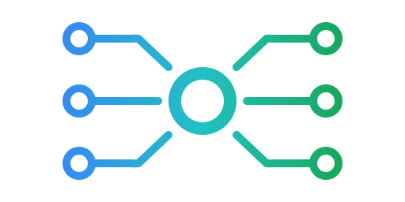

# Conduit 

### Multi‑Format, Database‑Agnostic REST Engine

Conduit is a **zero‑boilerplate REST engine** that instantly exposes your database as a fully‑typed, multi‑format HTTP API.

It supports **JSON, XML, YAML, TOML, NDJSON, CSV, and CBOR** — simultaneously — and works with **any SQL database** through a pluggable driver system.

Conduit eliminates the need to hand‑craft REST interfaces, controllers, serializers, or schema definitions.
Point it at a database, start the server, and your tables become live REST endpoints.

---

## ✨ Key Features

- **Multi‑Format Input & Output**  
  JSON, XML, YAML, TOML, NDJSON, CSV, and CBOR — all first‑class citizens with automatic content negotiation and query overrides (`?format=`).

- **Database‑Agnostic Architecture**  
  Official drivers for SQLite, PostgreSQL, MySQL/MariaDB, SQL Server, libSQL/Turso, ClickHouse, and Oracle Database, plus an in-memory testing driver.
  Swap databases or authorization modules without changing your API.

- **Zero‑Code REST API Generation**  
  Every database table automatically becomes a typed REST endpoint supporting `GET`, `POST`, `PUT`, `PATCH`, and `DELETE`.

- **SQL‑Like Query Filtering & Sorting**  
  Powerful `?where=` expressions (with `=`, `!=`, `<`, `>`, `<=`, `>=`, `LIKE`, `IN`, `NOT IN`, `IS NULL`, `IS NOT NULL`, `AND`, `OR`, `NOT`, and parenthetical grouping) and `?order=` sorting compiled into secure parameterized SQL.

- **Dynamic Schema API**  
  Introspect database catalogs (`GET /v1/schema`), inspect table column definitions (`GET /v1/schema/<table>`), create tables (`POST /v1/schema/<table>`), or drop tables (`DELETE /v1/schema/<table>`) via HTTP.

- **Strong Typing With Graceful Fallback**  
  SQL types are preserved when possible; incompatible types (e.g., datetime) are safely represented as strings.

- **Automated OpenAPI 3.0 & Interactive Docs**  
  Real-time OpenAPI 3.0 JSON specification at `/v1/openapi.json` and interactive Scalar API documentation at `/v1/docs`. Exportable via `--export-openapi` for CI/CD pipelines.

- **Pluggable Authorization & Security Policies**  
  Protect data using environment variable tokens, database-backed token tables with high-speed LRU caching, or permissive No-Op mode with global unauthenticated policy flags.

- **High Performance LRU Caching**  
  Thread-safe in-memory caching for compiled WHERE ASTs, query metadata, and auth tokens.

- **Config‑Driven Behavior**  
  Auto-detects configuration files in JSON, YAML, TOML, or XML.

- **Simple Deployment**  
  Single static binary or `go install`.

- **MIT‑Licensed Open Core**  
  Free to use, extend, and integrate.

---

## 🚀 Why Conduit?

Conduit combines:

- **Multi‑Format I/O**
- **Database‑Agnostic Routing**
- **Instant REST Generation**  
  …into a single engine that requires **no code** to expose a fully functional API.

It's ideal for:

- Rapid prototyping and MVPs
- Internal tools and admin dashboards
- High-throughput data ingestion and ETL pipelines (NDJSON / CSV)
- Multi‑format enterprise systems integration
- Database‑first applications
- Enterprise environments needing consistent REST interfaces

---

## 🧩 Architecture Overview

```plaintext
              ┌────────────────────────────────┐
              │          HTTP Request          │
              │ JSON / XML / YAML / TOML / CSV │
              │        NDJSON / CBOR           │
              └──────────────┬─────────────────┘
                             ▼
                    ┌───────────────────┐
                    │   Format Parser   │
                    └─────────┬─────────┘
                              ▼
                    ┌───────────────────┐
                    │   Conduit Core    │
                    │  Routing + Auth   │
                    │ Routing + Auth +  │
                    │ LRU Query Caches  │
                    └─────────┬─────────┘
                              ▼
                    ┌───────────────────┐
                    │   DB Driver API   │
                    │ SQLite / PG / ... │
                    └─────────┬─────────┘
                              ▼
                    ┌───────────────────┐
                    │   SQL Database    │
                    └─────────┬─────────┘
                              ▼
              ┌────────────────────────────────┐
              │          HTTP Response         │
              │ JSON / XML / YAML / TOML / CSV │
              │        NDJSON / CBOR           │
              └────────────────────────────────┘
```

---

## 📦 Installation

### Option A — Go Install

```bash
go install github.com/untappedtech/conduit@latest
```

### Option B — Prebuilt Binary

Download prebuilt binaries for Linux, macOS, and Windows under **GitHub Releases**.

### Option C — Build From Source

```bash
git clone https://github.com/untappedtech/conduit
cd conduit
go build -o conduit ./cmd/server
```

---

## ⚙️ Configuration

Conduit automatically searches for a configuration file in this order:

1. `config.json`
2. `config.yaml`
3. `config.yml`
4. `config.toml`
5. `config.xml`

You can also specify one manually:
You can also specify a custom configuration path or generate defaults:

```bash
# Specify config path
conduit --config ./myconfig.yaml
```

Or generate a default config:

```bash
# Generate a starter configuration
conduit --generate-config yaml
conduit --generate-config json
conduit --generate-config yaml
conduit --generate-config toml
conduit --generate-config xml

# Export OpenAPI 3.0 specification to file
conduit --config ./config.yaml --export-openapi ./openapi.json
```

### Minimal Example (`config.json`)

```json
{
    "server": {
        "host": "0.0.0.0",
        "port": 8080
    },
    "database": {
        "driver": "sqlite",
        "dsn": "./app.db"
    },
    "policy": {
        "publicReads": true,
        "publicWrites": true,
        "publicMutation": false
    }
}
```

### Minimal Example (`config.yaml`)

```yaml
server:
    host: "0.0.0.0"
    port: 8080
    base_path: "/v1/"
    default_limit: 50

database:
    driver: "sqlite"
    dsn: "./app.db?_pragma=journal_mode(WAL)&_pragma=busy_timeout(5000)"

policy:
    publicReads: true
    publicWrites: true
    publicMutation: false
```

---

## 🔐 Authorization Model

Conduit supports three access levels:

1. **Read‑Only (`ro`):** Allows `GET` and `HEAD` operations.
2. **Read‑Write (`rw`):** Allows `GET`, `POST`, `PUT`, `PATCH`, and `DELETE`.
3. **Schema‑Mutation / Admin:** Allows all CRUD operations plus table creation (`POST /v1/schema/<table>`) and table deletion (`DELETE /v1/schema/<table>`).

### **1. Read‑Only**

Allows `GET` operations.

### **2. Read‑Write**

Allows `GET`, `POST`, `PUT`, `PATCH`, `DELETE`.

### **3. Schema‑Mutation**

Allows creating new tables via:

```
POST /v1/schema/<tableName>
```

Allows deleting tables via:

```
DELETE /v1/schema/<tableName>
```

Access is controlled by:

- Bearer tokens (`Authorization: Bearer <token>`), direct authorization headers, or `X-API-Key` headers.
- Pluggable auth providers: Environment variables (`AUTH_TOKEN_*`), database tables (`dbAuth`) with LRU caching, or No-Op mode.
- Global policy flags: `publicReads`, `publicWrites`, and `publicMutation`.

- API keys
- Global flags:
    - `publicReads`
    - `publicWrites`
    - `publicMutation`

Authorization modules are pluggable.

---

## 📡 REST API Overview

Every table becomes a live endpoint:
                                             |
| Method   | Path                 | Description                                                         |
| :----:   | ----                 | -----------                                                         |
| `GET`    | `/v1/schema`         | List all database tables                                            |
| `GET`    | `/v1/schema/<table>` | Introspect table column metadata                                    |
| `POST`   | `/v1/schema/<table>` | Create a new table dynamically                                      |
| `DELETE` | `/v1/schema/<table>` | Drop a table from the database                                      |
| `GET`    | `/v1/<table>`        | List records with `limit`, `offset`, `order`, `where`, and `format` |
| `GET`    | `/v1/<table>/<id>`   | Fetch a single record by primary key                                |
| `POST`   | `/v1/<table>`        | Insert a new records                                                |
| `PUT`    | `/v1/<table>/<id>`   | Replace an existing record                                          |
| `PATCH`  | `/v1/<table>/<id>`   | Partially update specific fields on a record                         |
| `DELETE` | `/v1/<table>/<id>`   | Delete a record by primary key                                      |
| `GET`    | `/v1/docs`           | Interactive API documentation UI (Scalar)                           |
| `GET`    | `/v1/openapi.json`   | OpenAPI 3.0 JSON specification                                      |

### Query Parameters (`GET /v1/<table>`)

- **`limit`**: Maximum number of rows to return. Pass `limit=0` for unlimited mode.
- **`offset`**: Number of rows to skip before returning results.
- **`order`**: Sort by column: `?order=name:asc`, `?order=score:desc`, or `?order=name`.
- **`where`**: Filter using SQL-like expressions: `?where=score >= 10 AND status = 'active'`.
    - Operators: `=`, `!=`, `<`, `>`, `<=`, `>=`, `LIKE`, `IN`, `NOT IN`, `IS NULL`, `IS NOT NULL`, `AND`, `OR`, `NOT`.
    - Grouping with parentheses: `?where=(status = 'active' OR role = 'admin') AND age >= 21`.
- **`format`**: Response format (`json`, `xml`, `yaml`, `toml`, `ndjson`, `csv`, `cbor`).

---

## 🧪 Examples

### 1. Create a Table (Schema Mutation)

```bash
curl -X POST http://localhost:8080/v1/schema/players \
  -H "Content-Type: application/json" \
  -d '{
        "columns": [
          { "name": "id", "type": "integer", "autoincrement": true, "pk": true },
          { "name": "name", "type": "text", "nullable": false },
          { "name": "number", "type": "integer" },
          { "name": "team_id", "type": "integer" }
        ]
      }'
```

### 2. Insert Data (JSON)

```bash
curl -X POST http://localhost:8080/v1/players \
  -H "Content-Type: application/json" \
  -d '{"name": "Wayne Gretzky", "number": 99, "team_id": 7}'
```

### 3. Insert Data (YAML)

```bash
curl -X POST http://localhost:8080/v1/players \
  -H "Content-Type: application/x-yaml" \
  -d '
name: Mario Lemieux
number: 66
team_id: 12
'
```

### 4. Query Data (Filtered, Sorted & Exported as CSV)

```bash
curl "http://localhost:8080/v1/players?where=number%20%3E%3D%2050&order=number:desc&format=csv"
```


### 5. Interactive Documentation
Visit `http://localhost:8080/v1/docs` in your browser to explore your endpoints through the interactive Scalar OpenAPI interface.

### Go Client Example

```go
resp, err := http.Get("http://localhost:8080/v1/players")
if err != nil { panic(err) }
defer resp.Body.Close()

var players []map[string]interface{}
json.NewDecoder(resp.Body).Decode(&players)
fmt.Println(players)
```

---

## 🗄️ Supported Databases

  Conduit provides native support for:
- **SQLite** (`sqlite`) — Embedded file or in-memory database
- **PostgreSQL** (`postgres`) — Relational database engine
- **MySQL / MariaDB** (`mysql`) — Relational database engine
- **SQL Server** (`sqlserver`) — Microsoft SQL Server & Azure SQL
- **libSQL / Turso** (`libsql`) — Cloud edge SQLite database
- **ClickHouse** (`clickhouse`) — Columnar analytics engine
- **Oracle Database** (`oracle`) — Enterprise relational database
- **Memory** (`memory`) — Pure in-memory mock database for unit testing

Drivers are pluggable — implement the unified `Database` interface to support any SQL backend.

---

## 🧱 Schema Behavior

- Conduit does **not** require tables to exist ahead of time.
- Tables can be created dynamically via `/v1/schema/<table>`.
- Conduit does **not** perform migrations — it simply adapts to whatever schema exists.
  Comprehensive documentation is available under [`docs/`](docs/index.md):

---

## 📖 Complete Documentation

- **Core:** [Philosophy](docs/philosophy.md) _ [Getting Started](docs/getting-started.md) _ [Roadmap](docs/roadmap.md)
- **Formats:** [Overview](docs/formats.md) _ [JSON](docs/formats-json.md) _ [XML](docs/formats-xml.md) _ [YAML](docs/formats-yaml.md) _ [TOML](docs/formats-toml.md) _ [NDJSON](docs/formats-ndjson.md) _ [CSV](docs/formats-csv.md) \* [CBOR](docs/formats-cbor.md)
- **Configuration:** [Overview](docs/configuration.md) _ [Server](docs/config-server.md) _ [Database](docs/config-database.md) _ [Policy](docs/config-policy.md) _ [Auth Overview](docs/config-auth.md) _ [Env Auth](docs/config-auth-env.md) _ [DB Auth](docs/config-auth-db.md) \* [No-Op Auth](docs/config-auth-noop.md)
- **API Reference:** [Schema API](docs/schema-api.md) _ [CRUD API](docs/crud-api.md) _ [Query API](docs/query-api.md) _ [Pagination](docs/pagination.md) _ [Validation](docs/validation.md)
- **Architecture:** [Overview](docs/architecture.md) _ [Flow](docs/architecture-flow.md) _ [Multi-Format Engine](docs/architecture-multi-format-engine.md) _ [Database Drivers](docs/architecture-database-drivers.md) _ [Error System](docs/architecture-error-system.md)
- **Error Catalog:** [Error Index](docs/errors/index.md)

## 📈 Roadmap (Current Release Only)

Conduit v1.0.0 (Initial Release) focuses on:

- Multi‑format I/O
- Database‑agnostic routing
- Pluggable drivers
- Schema creation
- Authorization layers

Premium features (event bus, advanced output types, etc.) will be introduced later but are **not** included in this README.

---

## 📜 License

**MIT License**
Open core model — free for commercial and private use.

---

## 🤝 Contributing

Contributions are welcome.
Driver implementations, format handlers, and performance improvements are especially appreciated.

---

## ⭐ Acknowledgments

Conduit is built to make REST interfaces effortless — a universal, multi‑format bridge between your applications and your data.
Contributions are welcome. Driver implementations, format handlers, and performance improvements are especially appreciated.
