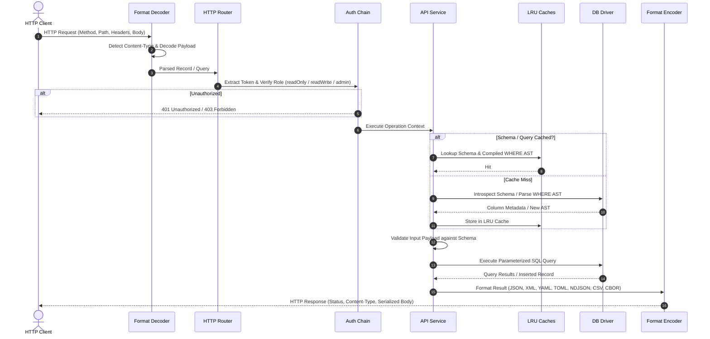

# High-Level Architecture Flow

Every HTTP request that enters Conduit follows a predictable, deterministic execution lifecycle. Each stage in the pipeline performs a discrete validation or transformation step before handing off to the next layer.

---

## Request Pipeline Flowchart

---

## Detailed Step-by-Step Breakdown

### 1. Request Ingestion & Decoding

When a request arrives, the **Format Decoder** inspects the `Content-Type` header:

- If body contains JSON, YAML, TOML, XML, CSV, NDJSON, or CBOR, it is parsed into normalized Go types (`map[string]any` or `[]map[string]any`).
- Query parameters (`where`, `order`, `limit`, `offset`, `format`) are extracted from the URL.

### 2. Route Matching

The **HTTP Router** checks the request against configured base paths:

- `/v1/schema` → Schema management routes (`handleSchema`).
- `/v1/docs` & `/v1/openapi.json` → Documentation and OpenAPI specs.
- `/v1/<table>` & `/v1/<table>/<id>` → Data routes (`handleCRUD`).

### 3. Authentication & Authorization

The **Authorization Chain** runs:

- Extracts token from `Authorization: Bearer <token>`, `Authorization: <token>`, `X-API-Key`, or `?token=`.
- Matches token against Environment variables or queries the Database Auth table (using LRU caching).
- Compares the token's granted role against the required operation permission (`readOnly`, `readWrite`, or `admin`).
- If unauthenticated, evaluates global `policy` flags (`publicReads`, `publicWrites`, `publicMutation`).

### 4. Service Logic & Caching

The **API Service** processes the operation:

- Checks the in-memory **Schema Cache** for column metadata. If missing, queries the driver and caches the result.
- For list queries with `where` clauses, checks the **AST Cache**. If missing, the lexer and parser generate a validated AST and cache it.
- Validates that fields exist, types match, and non-nullable fields are supplied.

### 5. Database Driver Execution

The **Database Driver** generates SQL tailored to the active database engine:

- Quotes table and column identifiers appropriately (e.g. `"id"` for SQLite/PostgreSQL, `` `id` `` for MySQL, `[id]` for SQL Server).
- Applies dialect-specific parameter placeholders (`?`, `$1`, `:p1`).
- Executes the query using connection pooling and returns row results.

### 6. Response Encoding

The **Format Encoder** converts results into the final payload:

- Uses `?format=` if provided; otherwise checks `Accept`, then echoes the input format, or falls back to JSON.
- Sorts fields according to table column schema order.
- Sets appropriate `Content-Type` headers and HTTP status codes (`200 OK`, `201 Created`, `204 No Content`).
